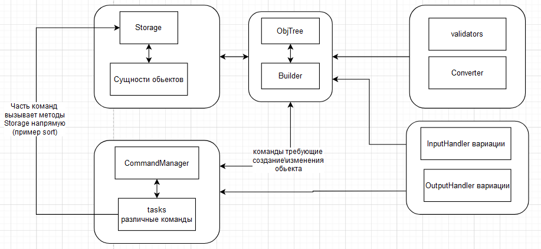

## ЛР №5 Программирование 
Стырил код - зафолловься   

---

### Структура программы


#### Общая структура

Программа подразделяется на 5 ключевых частей:
- Управление коллекцией [Storage](https://github.com/ArsenyVekshin/ITMO/blob/master/Prog/lab5/src/main/java/ArsenyVekshin/lab5/collection/Storage.java). 
- Дерево и builder для валидации/построения обьектов [Builder](https://github.com/ArsenyVekshin/ITMO/blob/master/Prog/lab5/src/main/java/ArsenyVekshin/lab5/utils/builder/Builder.java).
- Набор анотаций и универсальный валидатор для предыдущего модуля [Converter](https://github.com/ArsenyVekshin/ITMO/blob/master/Prog/lab5/src/main/java/ArsenyVekshin/lab5/utils/builder/Converter.java).
- Менеджер команд [CommandManager](https://github.com/ArsenyVekshin/ITMO/blob/master/Prog/lab5/src/main/java/ArsenyVekshin/lab5/commands/CommandManager.java).
- Набор стандатризированных оболочек для ввода-вывода [ui](https://github.com/ArsenyVekshin/ITMO/blob/master/Prog/lab5/src/main/java/ArsenyVekshin/lab5/ui).


#### Подробнее о управлении колекцией  
Каждое поле обьектов коллекции имеет набор анотаций, описанных в соответствующем модуле.   
Помимо приватных функций, данный менеджер имеет набор публицных методов для реализации заданных в ТЗ команд соответственно.   

#### Подробнее о дереве:
- Конфигурация(валидаторы) каждого поля класса устанавливается при помощи анотаций, насследованных от [ValidatableAnnotation](https://github.com/ArsenyVekshin/ITMO/tree/master/Prog/lab5/src/main/java/ArsenyVekshin/lab5/utils/validators)
- Каждое поле имеет свое имя(для клиента), тип(для автоматического приведения типов, [Converter](https://github.com/ArsenyVekshin/ITMO/blob/master/Prog/lab5/src/main/java/ArsenyVekshin/lab5/utils/builder/Converter.java)),
а также набор анотаций запрашиваемых автоматически
- Для коректной работы требует от непримитивов переопределения функции ``getConstructorReference``
- В результате работы ``Builder`` получаем ``HashMap<fieldname, Object>``, из которого конструктор собирает искомый объект
- При построении объекта клиентом мы ВСЕГДА используем дерево.

#### Подробнее о взаимодействии с клиентом
В основе взаимодействия команд с клиентом лежит класс [Builder](https://github.com/ArsenyVekshin/ITMO/blob/master/Prog/lab5/src/main/java/ArsenyVekshin/lab5/utils/builder/Builder.java), 
он использует заранее постороеное дерево объекта (класс [ObjTree](https://github.com/ArsenyVekshin/ITMO/blob/master/Prog/lab5/src/main/java/ArsenyVekshin/lab5/utils/builder/ObjTree.java)).   
Для КАЖДОЙ команды создан отдельный класс, насследованный от необходимого подвида ```Command```.   
```CommandManager``` хранит в себе глобальные потоки ввода-вывода, что позволяет исполнять команду без зависимости работаем мы с консолью или с файлом

